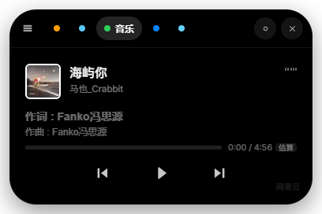
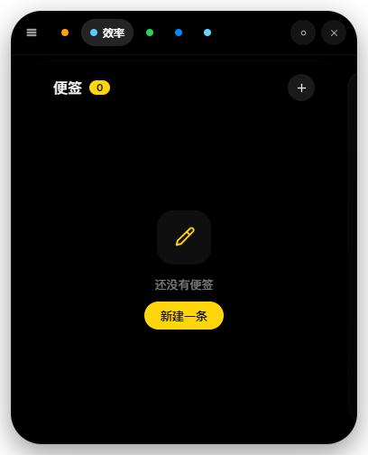
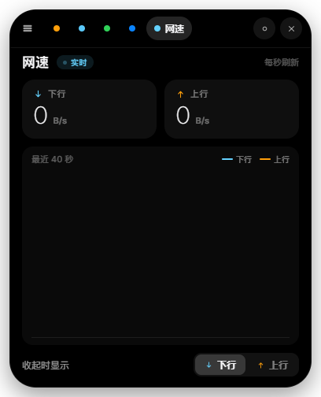
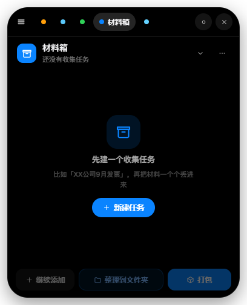
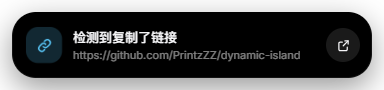

# Windows 灵动岛（Dynamic Island）

> 把 iPhone 的灵动岛搬到 Windows 桌面 —— 一个无边框、透明、置顶的小胶囊，悬停展开成卡片，内置八个可单独启停的岛内应用。

<p>


</p>

<table>
<tr>
<td width="50%" align="center"><b>紧凑态</b><br/><sub>屏幕顶部的小胶囊 150×40，日常时间只留居中时间 + 右侧圆环</sub></td>
<td width="50%" align="center"><b>展开态</b><br/><sub>悬停展开成卡片，顶部切换应用、下面是对应面板</sub></td>
</tr>
<tr>
<td></td>
<td></td>
</tr>
</table>

## 功能一览

**形态**：紧凑态（小胶囊）↔ 展开态（自适应高度：时间 384×480、音乐 384×248）↔ 通知态（360×66）三态丝滑形变。复制到链接、计时结束、提醒到点时，胶囊会主动形变「触达」你。

**岛内应用**（顶部五个标签，共八个应用，都能在设置里单独启停）：

| 应用 | 主题色 | 一句话 |
| --- | --- | --- |
| 🕐 时间 | 橙 | 日常时间 / 倒计时 / 提醒 / 专注 四合一，合并了工作时间统计与「下一提醒」 |
| 📝 便签 | 黄 | 标题 + 正文 + 颜色标签，紧凑态显示最新一条摘要 |
| ✅ 待办 | 绿 | iOS 圆形勾选框 + 完成进度条，可被「专注」关联 |
| 💬 常用语 | 紫 | 常用短句一键复制 |
| 📋 剪贴板 | 蓝 | 复制历史、搜索、一键复制；识别到网址时胶囊形变提醒并可一键跳转 |
| 🎵 音乐 | 绿 | 接管系统媒体会话，**KTV 式逐字擦除歌词**，紧凑态直接显示歌词条 |
| 📥 材料箱 | 蓝 | 一件事的一批材料：拖到岛上收着 → 齐了 → 一次整理/打包（不动原文件） |
| 📶 网速 | 青 | 实时上下行速率 + 最近 40 秒波形 |

> 便签 / 待办 / 常用语 / 剪贴板 收在顶部第二个标签「**效率**」里，用卡片堆栈左右滑动切换。

**系统能力**：

- 🚀 **流畅动画**：固定窗口 + 渲染进程内 GSAP 形变，规避原生窗口缩放卡顿；透明区域鼠标穿透，不挡桌面操作。
- ✨ **Q 弹动效**：统一 `back.out` 过冲缓动，含错落入场、指示器回弹、通知态上滑、计时脉冲。
- 📌 **顶部吸附**：拖到屏幕顶部自动吸附贴边（形如「刘海」），向下拖离即解除。
- 🔊 **系统音效**：Web Audio 现场合成八种音效，无需外部音频文件，右键可开关。
- 🍎 **苹果设计语言**：纯黑胶囊、发丝边框、超椭圆圆角、Apple 系统色，克制排版，**无渐变**。
- 🔤 **字体**：西文 **Inter** + 中文 **PingFang SC 苹方**（六个字重），缺失时回退 MiSans → Segoe UI。
- ⚙️ **独立设置窗口**：980×700 自绘标题栏，5 页 + 实时预览，改完立即生效、不用重启。
- 🧩 **可扩展**：每个应用一个 manifest 即可接入，详见[功能详解](docs/功能详解.md)。

## 界面预览

**音乐**：紧凑态让位给歌词条（266×40，封面在转 + 已唱亮色/未唱灰色）；展开态是半高面板，封面 + 歌词 + 进度 + 控制器。

<table>
<tr>
<td width="42%"></td>
<td width="58%"></td>
</tr>
</table>

**其他应用**（展开态）：

<table>
<tr>
<td width="50%"></td>
<td width="50%"></td>
</tr>
<tr>
<td></td>
<td></td>
</tr>
</table>

**通知态**（复制到链接时胶囊主动形变，可直接打开）：



**设置窗口**（常规 / 外观 / 应用）：

<table>
<tr>
<td width="33%"></td>
<td width="33%"></td>
<td width="33%"></td>
</tr>
</table>

> 以上都是**真实构建产物的离屏渲染截图**，不是手绘稿；改动 UI 后按 [docs/images/README.md](docs/images/README.md) 重新生成。

## 运行

```bash
npm install
npm run dev        # 开发模式（Vite 热更新 + 自动启动 Electron）
```

```bash
npm run build      # 构建渲染进程 + 主进程/预加载
npm run start      # 运行打包产物
npm run pack:win   # 打包 Windows exe（NSIS 安装包 + 免安装便携版，输出到 release/）
```

## 操作方式

| 操作 | 说明 |
| --- | --- |
| 鼠标移入胶囊 | 展开灵动岛（移出收起，可被「固定」阻止） |
| 点击顶部圆点 | 切换岛内应用 |
| 拖动 `≡` 手柄 / 胶囊 | 移动窗口；拖到屏幕顶部附近松手自动吸附贴边 |
| `Esc` | 收起（通知态下先收起提醒） |
| **把文件拖到岛上** | 加入当前材料任务（拖拽不灵时可用「继续添加」走系统文件框） |
| 点击通知条 | 空白处 = 确认并收起；右侧按钮 = 打开链接 / 「知道了」停止催办 |
| 右键任意位置 | 菜单：切换应用 / 吸附顶部 / 音效 / 设置 / 退出 |

## 项目结构

```
dynamic-island/
├── electron/                  # 主进程
│   ├── main.js                # 固定窗口、鼠标穿透、IPC、托盘、右键菜单、拖拽收集
│   ├── settings.js            # 设置存储（userData/settings.json）
│   ├── materialbox.js zip.js  # 材料箱：元数据管理 + 零依赖流式 ZIP
│   ├── music/                 # 音乐模块：SMTC 桥接 / 歌词抓取 / 封面
│   └── preload.js             # contextBridge 安全 API
├── src/
│   ├── components/            # DynamicIsland.vue（岛核心）/ LyricPill.vue / CardCarousel.vue / Icon.vue
│   ├── composables/           # useIsland（状态机+形变）/ useSettings（设置镜像）
│   ├── apps/                  # 岛内应用：每个目录一个 manifest（index.js）
│   │   ├── time/              #   时间：modes/ 下是 clock / countdown / reminder / focus
│   │   ├── efficiency/        #   效率：modes/ 下是 notes / todo / phrases / clipboard
│   │   ├── music/             #   音乐
│   │   ├── materialBox/       #   材料箱
│   │   └── net/               #   网速
│   ├── settings/              # 独立设置窗口（sections/ 五页 + 通用控件）
│   ├── utils/sound.js         # Web Audio 音效引擎
│   └── styles/                # 全局变量与字体
├── docs/                      # 文档与配图
└── build/ scripts/            # 应用图标与生成脚本
```

## 文档

| 文档 | 内容 |
| --- | --- |
| [功能详解](docs/功能详解.md) | **完整文档**：每个应用的功能细节、动画/音效/吸附/穿透机制、设置项、IPC 清单、目录结构、已知限制 |
| [音乐模块设计](docs/音乐模块设计.md) | 音乐模块的设计与实测：Windows SMTC 能力矩阵、KTV 擦除、歌词引擎与字形、进度估算 |
| [时间·卡片堆栈导航设计](docs/时间-卡片堆栈导航设计.md) | 「效率」标签内卡片堆栈导航的交互设计 |
| [文档配图](docs/images/README.md) | 配图清单与重新生成方法 |

## 注意

- ⚠️ **苹方（PingFang SC）是 Apple 专有字体，仅限本地使用，请勿提交到公开仓库或随包分发**。仓库里不含字体文件，缺失时自动回退 MiSans → Segoe UI + 微软雅黑，构建不受影响。
- **打包前请先退出正在运行的灵动岛**（托盘右键 → 退出）。运行中的实例会锁住 `release/win-unpacked/resources/app.asar`，`electron-builder` 清理旧产物时会报文件占用。
- 胶囊尺寸常量需在 `src/composables/useIsland.js` 的 `SIZES`、`src/styles/main.css` 的 CSS 变量、`src/components/DynamicIsland.vue` 的 `.notice-slot`、`electron/main.js` 的 `WIN` **四处同步维护**。
