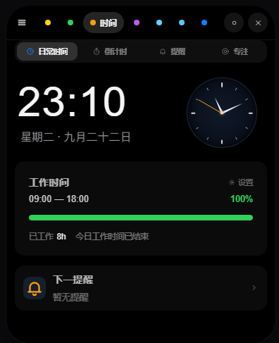
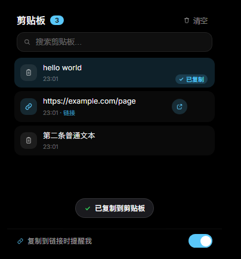
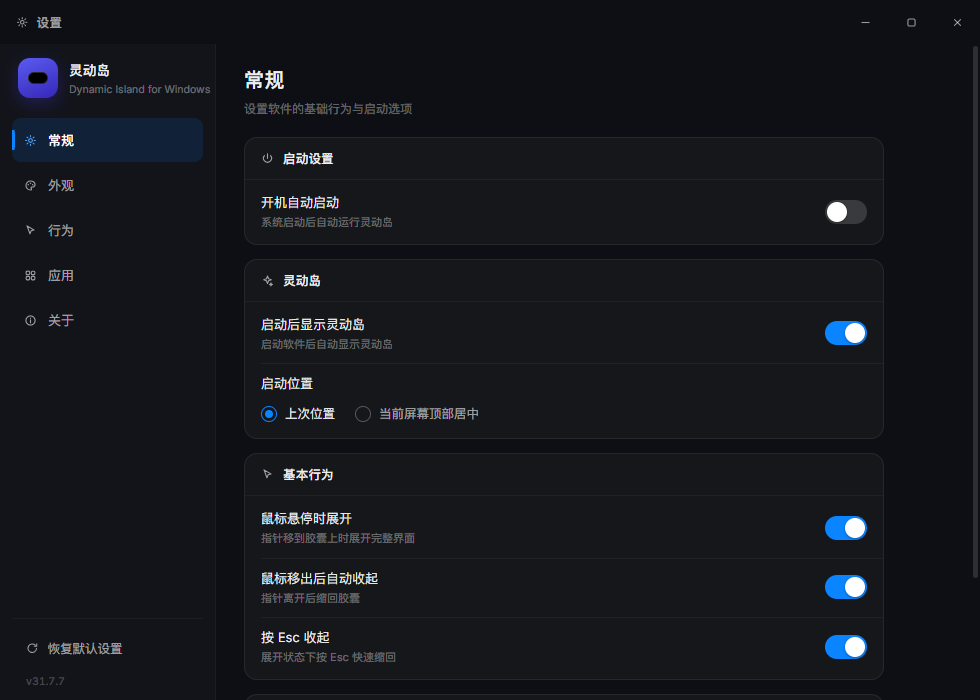
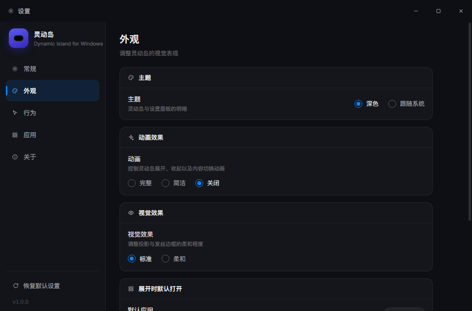
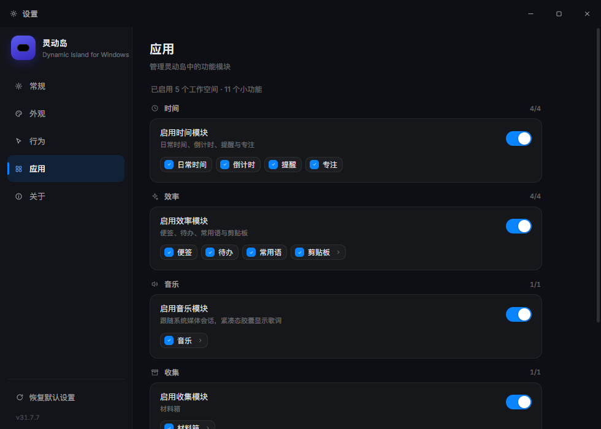

# 灵动岛 · 功能详解

> 一个运行在 Windows 平台的「灵动岛」，模仿苹果 iPhone 灵动岛形态，使用 **Electron + Vue 3 + Vite** 构建。本文档完整记录所有功能细节、交互方式、技术实现与扩展方法。

---

## 目录

1. [项目概览](#1-项目概览)
2. [技术栈](#2-技术栈)
3. [运行方式](#3-运行方式)
4. [窗口与形态](#4-窗口与形态)
5. [动画系统](#5-动画系统)
6. [音效系统](#6-音效系统)
7. [交互操作大全](#7-交互操作大全)
8. [顶部吸附](#8-顶部吸附)
9. [鼠标穿透机制](#9-鼠标穿透机制)
10. [八个岛内应用](#10-八个岛内应用)
11. [设置面板（独立窗口）](#11-设置面板独立窗口)
12. [可扩展应用框架](#12-可扩展应用框架)
13. [数据持久化](#13-数据持久化)
14. [IPC 接口清单](#14-ipc-接口清单)
15. [目录结构](#15-目录结构)
16. [尺寸与常量同步点](#16-尺寸与常量同步点)
17. [已知限制与注意事项](#17-已知限制与注意事项)

---

## 1. 项目概览

- 窗口形态是一个**纯黑小胶囊**，位于屏幕顶部居中，形似 iPhone 的「灵动岛」。
- 鼠标悬停时，胶囊平滑**展开**为一张卡片；移开时**收起**回胶囊。
- 胶囊内可承载多个「岛内应用」，在应用间自由切换，功能可无限扩展。
- 另有一个**独立的设置窗口**（980×700，不进胶囊），负责所有偏好配置。

<table>
<tr>
<td width="34%" align="center"><b>紧凑态</b><br/><sub>150 × 40</sub></td>
<td width="66%" align="center"><b>展开态</b><br/><sub>384 × 480（音乐为半高 384 × 248）</sub></td>
</tr>
<tr>
<td></td>
<td></td>
</tr>
</table>

> 本文里的截图都是**真实构建产物的离屏渲染**，随代码更新；生成方式见 [images/README.md](images/README.md)。

## 2. 技术栈

| 层    | 技术                              |
| ---- | ------------------------------- |
| 桌面框架 | Electron 31                     |
| 前端框架 | Vue 3（`<script setup>`）         |
| 构建工具 | Vite 5 + `vite-plugin-electron` |
| 动画   | GSAP（形变 / 补间）                   |
| 音效   | Web Audio API（现场合成，无音频文件）       |
| 字体   | Inter（西文）+ PingFang SC 苹方（中文），本地可选，见 4.3.1 |
| 打包   | electron-builder（NSIS 安装包 + portable 单文件） |

## 3. 运行方式

```bash
cd dynamic-island
npm install     # 首次安装依赖
npm run dev     # 开发模式（热更新 + 自动启动窗口）
npm run build   # 构建生产产物到 dist/
npm run start   # 用 Electron 直接运行已构建产物
```

---

## 4. 窗口与形态

### 4.1 窗口属性

- 无边框（`frame: false`）、透明背景（`transparent: true`）、不可缩放。
- **置顶**（`alwaysOnTop: true`）、跳过任务栏（`skipTaskbar: true`）。
- 固定尺寸 `424 × 560`（比展开态卡片略大，用于容纳投影与透明区域；**高度特意留了余量**，因为形变用 `back.out` 过冲缓动，展开途中胶囊高度会冲到约 524px，窗口不够高会被下边缘裁掉）。
- 初始位置：所在显示器工作区顶部居中。

### 4.2 三态形态

| 状态      | 尺寸        | 圆角       |
| ------- | --------- | -------- |
| 紧凑态（胶囊） | 150 × 40  | 22px（四角） |
| 歌词条（音乐接管紧凑态） | 266 × 40 | 22px（四角） |
| 展开态（卡片） | 384 × 480（按应用自适应，音乐为 384 × 248） | 34px（四角） |
| 通知态（提醒条） | 360 × 66  | 24px（四角） |

- 形变全部在**渲染进程内由 GSAP 驱动**（`width` / `height` / `border-radius` / `top`），不再做原生窗口缩放——这是保证动画流畅的关键。
- 展开态卡片内包含：顶部应用栏（拖动手柄 + 应用标签 + 固定/隐藏按钮）+ 应用正文区。
- **通知态**是临时状态：剪贴板识别到链接、计时结束或提醒到点时，胶囊会形变到通知尺寸主动「触达」用户（内容上滑 + 回弹入场、左侧图标脉冲、提示音），默认 6~7 秒后自动回到原状态。
- 鼠标悬停在通知上会**暂停**自动收起计时，方便读完再点。
- 通知条右侧按钮随内容变化：链接类通知为「打开链接」，提醒类通知为「知道了」（点它即确认，不再催办）。
- 通知只在**紧凑态**弹出：展开态不打断用户（例如正在编辑便签、草稿未保存），此时改为播放提示音 + 胶囊脉冲。

### 4.3 视觉设计（苹果设计语言）

- 纯黑胶囊 `#000`（还原 OLED 黑），无渐变。
- 1px 发丝边框 + 柔和投影营造层次。
- Apple 系统色板：黄 `#FFD60A`、绿 `#30D158`、蓝 `#0A84FF`、红 `#FF453A`、橙 `#FF9F0A`、紫 `#BF5AF2`、灰 `#8E8E93`。
- 超椭圆圆角、发丝分隔线、克制排版、`tabular-nums` 等宽数字。

### 4.3.1 字体

- 字体栈：`'Inter' → 'PingFang SC' → 'MiSans' → 'HarmonyOS Sans SC' → -apple-system → 'SF Pro Text' → 'Segoe UI' → 'Microsoft YaHei'`。字体族回退是**按字形**生效的，所以「时间 12:34」这类混排会自动用 Inter 出数字、苹方出汉字。
- 本地字体文件放在 `src/assets/fonts/`，由 `src/styles/fonts.css` 用 `@font-face` 声明（`main.css` 顶部 `@import`）。
  - 西文/数字：**Inter**（SIL OFL），官方可变字体 `InterVariable.woff2` 一个文件覆盖 100–900。
  - 中文首选：**PingFang SC 苹方**，六个字重各一个文件，按 CSS 字重显式声明。

    | 文件 | CSS 字重 |
    | --- | --- |
    | `PingFangSC-Ultralight.woff2` | 100 |
    | `PingFangSC-Thin.woff2` | 200 |
    | `PingFangSC-Light.woff2` | 300 |
    | `PingFangSC-Regular.woff2` | 400 |
    | `PingFangSC-Medium.woff2` | 500 |
    | `PingFangSC-Semibold.woff2` | 600，另以 `font-weight: 700 800` 再声明一次给 700/800 复用 |

  - 六个文件均为**完整字库**（42,199 字形 / 29,924 覆盖码位，含 CJK 扩展 B，最大 U+2FA07），非裁剪子集。
  - **字重无法从文件元数据推断**：苹方文件里 `usWeightClass` 全是 400、`macStyle`/`fsSelection` 也都是常规值，`name` 表的 Typographic Subfamily 还被转档工具改写成了 `Light/ExtraLight/Regular/Medium/Bold/Heavy` 这种与真实重量错位的通用档位名。因此字重**只由 `fonts.css` 的声明决定**；真实轻重已用 `hmtx` 左侧边距核对（随字重单调递减：Ultralight 63.0 → Semibold 46.1），文件名与实际字重一致。
  - **苹方没有 Bold**：界面中的 `font-weight: 700 / 800` 复用 Semibold，显式再声明一条 `@font-face` 是为了拿到真字形而不是把 Regular 拉成**合成假粗**。
  - 中文回退：**MiSans**（小米，免费商用，观感最接近苹方）→ **HarmonyOS Sans SC**。苹方文件缺失时自动落到 MiSans。
  - **子集化（省内存）**：完整苹方每个字重 42199 字形，实测在渲染进程里占 **10.9MB**；UI 常见的 300/400/500/600 同时驻留就是 40MB 量级。`npm run fonts:subset`（`scripts/subset-fonts.mjs`）把它们子集到 **3755 个常用字 + ASCII + 标点 + 仓库里实际出现过的字**，每份降到 **0.6MB**、驻留内存 **1.3MB**（-88%）。每个 `@font-face` 写两个 `src`：先子集、失败退回完整字体，所以没跑过脚本也不影响。
  - 子集**故意不含罕用字**，那些字回落到 MiSans（完整字重、不参与子集化）—— 这条回退链本来就在字体栈里，不会出现方块字。
  - 子集产物在 `src/assets/fonts/subset/`，和完整苹方一样**不进仓库**（同为苹方衍生数据）。
- **文件缺失不会导致构建失败**：Vite 只给一条 warning，URL 原样保留（运行期 404 后静默回退到系统字体）；文件存在时会被打包进 `dist/assets/` 并改写成带 hash 的相对路径，`base: './'` 保证 `file://` 生产环境也能加载。
- ⚠️ **苹方是 Apple 专有字体**，授权仅限 Apple 设备。放进 `src/assets/fonts/` 供本机使用没问题，但**提交到公开仓库或打进 exe 分发属于再分发（侵权）**。公开发布时请改用 MiSans / HarmonyOS Sans SC / 思源黑体等允许商用的字体——把 `fonts.css` 里 `'PingFang SC'` 那一组注释掉即可，字体栈会自动落到 MiSans，无需改其它代码。
- 同理不使用 Apple 的 **SF Pro**（同为专有字体）；西文由 Inter 承担，观感接近。

### 4.4 系统托盘

- 展开态右上角 `✕` 按钮将窗口**隐藏到系统托盘**（不退出程序）。
- 托盘图标单击或右键菜单「显示灵动岛」可恢复；「退出灵动岛」才真正退出。
- 托盘图标复用 `build/icon.png`（打包时经 `files` 配置打入产物）。
- 隐藏不销毁窗口，恢复后形态/应用/数据原样保留。

### 4.5 图标系统（内联 SVG）

所有**图标一律使用 `src/components/Icon.vue` 渲染内联 SVG**（24×24 viewBox、`currentColor` 着色、圆头线条风格），不再依赖字体符号，渲染在各平台完全一致、缩放不失真、随按钮颜色自动适配。

| 名称          | 用途                       |
| ----------- | ------------------------ |
| `play` / `pause` | 计时播放 / 暂停               |
| `reset`      | 计时重置                     |
| `skip`       | 专注时间跳到下一阶段（专注 ↔ 休息）      |
| `repeat`     | 提醒的「多次提醒」开关（循环箭头）        |
| `close`      | 关闭 / 删除（叉号）               |
| `plus`       | 添加（便签 / 待办 / 常用语 / 提醒）    |
| `back`       | 便签编辑返回（左箭头）               |
| `drag`       | 展开态拖动窗口手柄（三横线）            |
| `dot-on` / `dot-off` | 固定 / 取消固定展开态             |
| `check`      | 勾选 / 已复制（对勾）              |
| `pencil`     | 便签（编辑铅笔）                  |
| `quote`      | 常用语（引号）                   |
| `clock`      | 日常时间                      |
| `timer`      | 倒计时（秒表）                   |
| `bell`       | 提醒（铃铛）                    |
| `focus`      | 专注（同心圆靶心）                 |
| `settings`   | 工作时间设置                    |
| `stop`       | 专注「结束」                    |
| `chevron-right` | 列表行跳转指示                |
| `chart`      | 专注统计                      |
| `calendar`   | 提醒日期                      |
| `target`     | 专注关联任务                    |
| `sun`        | 今天休息                      |
| `clipboard`  | 剪贴板（文本条目）                 |
| `link`       | 识别到链接（链环）                 |
| `external`   | 一键跳转打开链接（外链箭头）            |
| `copy`       | 复制                        |
| `trash`      | 清空历史                      |
| `search`     | 搜索框图标                     |
| `arrow-down` / `arrow-up` | 网速下行 / 上行（方向箭头）       |

> 各应用 manifest 的 `icon` 字段（如 `✎`）仅为「未提供紧凑视图」时的兜底元数据，当前六个应用均有自定义紧凑视图，正常不显示。

---

## 5. 动画系统

> 整体手感偏 **「Q 弹」**：关键动效统一用 GSAP 的 `back.out(过冲强度)` 代替纯 `expo.out`，让元素先冲过目标位置再弹回；CSS 过渡则统一用 `cubic-bezier(0.34, 1.56, 0.64, 1)`（easeOutBack）。

| 动画        | 实现                                      | 说明                                                  |
| --------- | --------------------------------------- | --------------------------------------------------- |
| 紧凑 ↔ 展开形变 | GSAP 补间 `width/height/borderRadius/top` | **放大** `back.out(1.7)`（约 10% 过冲后收回）、**缩小** `back.out(0.7)`（只留极轻回弹，避免压扁后裁掉内容）；`overwrite:'auto'` 可被打断 |
| 通知态形变 + 入场 | GSAP 形变 + `fromTo`                    | 胶囊形变到 360×66，通知内容 `y:-20 → 0` + `scale .9 → 1`（`back.out(2.4)`），左侧图标循环脉冲 |
| 接收态（拖入文件） | CSS `@keyframes dropGlow`               | 强调色描边 + 呼吸光晕，全程只做轻微明暗变化，刻意不做放大 / 位移 —— 拖拽时求「稳」不求「弹」 |
| 胶囊脉冲（开始 / 结束） | CSS `@keyframes pillPulseStart` / `pillPulseEnd` | 只动 `box-shadow` 向外扩散一圈光晕：开始=绿，结束/提醒=红（重复 2 次）  |
| 展开内容分镜入场  | GSAP `fromTo` + `back.out`              | 头部 `y:-14 → 0`（`back.out(2.4)`）、正文 `y:22 → 0` + `scale .97 → 1`（`back.out(2)`），都带回弹 |
| 滑动标签指示器   | GSAP 补间 `x` + `width`，`back.out(1.7)`   | 高亮胶囊滑过头一点再弹回，宽度随名字伸缩                                 |
| 应用切换      | Vue `<Transition>`                      | 上滑 + 缩放入场，`cubic-bezier(0.34,1.56,0.64,1)`（easeOutBack，末端过冲） |
| 紧凑/展开内容切换 | Vue `<Transition>`                      | 交叉淡入淡出 + `scale .92 → 1` 的 easeOutBack 缩放回弹              |
| 时间面板切换    | Vue `<Transition>`                      | 「日常时间 / 倒计时 / 提醒 / 专注」四个面板交叉上滑切换                     |
| 便签/待办增删   | `<TransitionGroup>`                     | 弹性入场 + 位移离场 + `move` 重排                             |
| 待办勾选      | `<Transition>`                          | 对勾 `scale(0→1)` 弹性弹出                                |
| 呼吸指示点     | CSS `@keyframes pulse`                  | 便签 / 网速等紧凑态圆点脉动                                      |
| 计时圆点呼吸    | CSS `@keyframes dotPulse`               | 时间应用紧凑态小圆点，在倒计时 / 专注运行中缩放呼吸表示「还在跑」                  |
| 网速波形左移    | GSAP 线性补间 `<g>` 位移                     | 每个采样点先右移一格、再线性滑回 0，形成 ECharts 式向左流动                  |
| 按钮悬浮      | CSS `transform: scale()` + easeOutBack   | 各处按钮悬停放大；灵动岛顶栏按钮/通知按钮用弹性回弹过渡                        |
| 计时完成闪烁    | CSS `@keyframes blink`                  | 时间数字红色闪烁                                            |
| 合成层优化     | `will-change` / `transform`             | 形变只发生在 GPU 合成层内，不触发窗口级重绘                            |

---

## 6. 音效系统

`src/utils/sound.js` 使用 **Web Audio API 现场合成**单音（振荡器 + 增益包络），无需任何外部音频文件。

| 场景    | 音效      | 合成参数（频率/音型）          |
| ----- | ------- | -------------------- |
| 展开    | 上扬双音    | 660Hz → 990Hz，正弦     |
| 收起    | 下扬双音    | 900Hz → 560Hz，正弦     |
| 吸附顶部  | 低沉「咔哒」  | 480Hz，三角波            |
| 解除吸附  | 清脆上扬    | 760Hz，三角波            |
| 切换应用  | 短促 tick | 1250Hz，正弦            |
| 通知触达  | 上行三音    | 784 → 1046 → 1568Hz，正弦 |
| 计时开始  | 短促上扬双音  | 523 → 784Hz，正弦       |
| 计时结束 / 提醒 | 四声提示 | 1470Hz × 4（间隔 0.18s） |
| 勾选待办 / 复制成功 | 极轻 tick | 1650Hz，正弦            |

- 音效开关：右键菜单「音效」，状态持久化到 `localStorage`。
- 主进程追加 `autoplay-policy` 开关，保证无用户手势也能出声。

---

## 7. 交互操作大全

| 操作               | 效果                          |
| ---------------- | --------------------------- |
| 鼠标移入胶囊           | 展开灵动岛（120ms 延迟触发）           |
| 鼠标移出             | 收起（260ms 延迟，可被「固定」阻止）       |
| 点击胶囊（紧凑态）        | 立即展开                        |
| 点击顶部应用标签         | 切换岛内应用                      |
| `●` / `○` 按钮     | 固定 / 取消固定展开态                |
| `✕` 按钮 | 隐藏到系统托盘（托盘图标单击 / 菜单恢复） |
| `Esc` 键 | 收起（无视固定状态） |
| 悬停通知条 | 暂停自动收起计时（移开继续） |
| 点击通知条空白处 | 收起提醒（不会顺势展开），并视为「已确认」 |
| 点击通知条右侧按钮 | 链接通知=用系统浏览器打开；提醒通知=「知道了」确认 |
| 通知态下按 `Esc` | 收起提醒（而不是收起卡片） |
| 拖动 `≡` 手柄（展开态）   | 移动窗口                        |
| 拖动胶囊（紧凑态）        | 移动窗口                        |
| 拖到屏幕顶部附近松手       | 自动吸附贴边                      |
| 向下拖离顶部           | 解除吸附                        |
| 右键任意位置           | 弹出菜单（切换应用 / 吸附顶部 / 音效 / 退出） |

> **右键菜单与自动收起**：原生菜单弹出期间渲染进程收不到 `mousemove`，`hovering` 会一直停在 `true`，所以菜单关闭后会由主进程回传光标位置，渲染进程重新做一次命中检测 —— 光标已离开胶囊就自动收起。
> 但如果用户**点了具体菜单项**（例如「材料箱 → 打包」），主进程会带上 `keepOpen` 标记，此时不收起，否则刚打开的面板会被立刻收掉。
> 「音效」是勾选框，勾选 = **有声音**：渲染进程上报的是 `!isMuted()`。

---

## 8. 顶部吸附

- **触发**：拖动手柄或胶囊，松手时若窗口距屏幕顶部 < 48px 且为「向上拖」，自动吸附贴边。
- **方向感知**：记录拖动起点窗口 y 坐标，判断净位移方向——**向下拖 = 拖离顶部，永不吸附，必然解除**；只有向上拖到顶才吸附。
- **吸附形态**：胶囊顶部两角圆角平滑归 0（直角贴边），底部保留圆角，形如 iPhone「刘海」。
- **过渡动画**：圆角 + 顶部偏移（浮动 16px ↔ 贴边 0px）一起用 `expo.out` 补间。
- **持久化**：吸附状态存入 `localStorage`（`island.docked`），重启还原。
- **右键开关**：菜单「吸附顶部」可直接切换（带勾选状态同步）。
- **多显示器**：通过 `screen.getDisplayMatching` 精确取窗口所在屏工作区。

---

## 9. 鼠标穿透机制

- 窗口固定尺寸，透明区域通过 `setIgnoreMouseEvents(true, { forward: true })` 做**鼠标穿透**，不阻挡桌面操作。
- 渲染进程转发 `mousemove`，用 `getBoundingClientRect` 做命中检测：鼠标在胶囊范围内 → 关闭穿透（可交互）；离开 → 重新穿透。
- 这是「固定窗口 + 胶囊裁剪揭示」方案能同时兼顾「流畅动画」与「不挡桌面」的核心。

---

## 10. 八个岛内应用

> 顶部五个标签：**时间 / 效率 / 音乐 / 材料箱 / 网速**。其中「效率」里装着便签 / 待办 / 常用语 / 剪贴板四个应用，
> 用卡片堆栈左右滑动切换（见 [时间-卡片堆栈导航设计.md](时间-卡片堆栈导航设计.md)）。

| # | 应用 | id | 主题色 | 一句话 |
| --- | --- | --- | --- | --- |
| 1 | 便签 | `notes` | 黄 `#FFD60A` | 标题 + 正文 + 颜色标签 |
| 2 | 待办 | `todo` | 绿 `#30D158` | iOS 圆形勾选 + 进度条 |
| 3 | 时间 | `time` | 橙 `#FF9F0A` | 日常时间 / 倒计时 / 提醒 / 专注 四合一 |
| 4 | 常用语 | `phrases` | 紫 `#BF5AF2` | 常用短句一键复制 |
| 5 | 网速 | `net` | 青 `#64D2FF` | 实时上下行 + 波形图 |
| 6 | 剪贴板 | `clipboard` | 蓝 `#5AC8FA` | 复制历史 + 链接一键跳转 |
| 7 | 材料箱 | `material-box` | 蓝 `#0A84FF` | 一件事的一批材料：拖进来 → 齐了 → 一次打包 |
| 8 | 音乐 | `music` | 绿 `#30D158` | 接系统媒体会话，胶囊里放 KTV 歌词条 |

### 10.1 便签（notes · 黄 `#FFD60A`）

- **功能**：新建 / 编辑 / 删除便签，标题 + 正文，6 种颜色标签。
- **列表视图**：便签卡片（颜色竖条 + 标题 + 摘要 + 更新时间），悬停显示删除按钮，右上角显示条数徽标。
- **编辑视图**：标题输入框 + 正文多行输入 + 色板选择 + 保存 / 返回 / 删除。
- **紧凑态**：呼吸圆点 + 图标 + 最新一条便签摘要。
- **持久化**：`localStorage`（`island.notes.v1`）。

### 10.2 待办（todo · 绿 `#30D158`）

- **功能**：添加 / 勾选 / 删除待办，一键清除已完成。
- **iOS 圆形勾选框**：勾选带 `pop` 弹性动画，完成项划线置灰。
- **顶部进度条**：显示完成比例（`已完成 / 总数`）。
- **快捷添加**：顶部输入框回车或点 `＋` 添加。
- **紧凑态**：绿色对勾 + 「X 项待办」/「全部完成」。
- **持久化**：`localStorage`（`island.todos.v1`）。

### 10.3 时间（time · 蓝 `#0A84FF`）—— 时间中心

由原「时钟」与「倒计时」合并而来，第二阶段升级为**时间中心**：紧凑态回答「现在发生什么」，展开态负责「管理时间」。四个模式由顶部「岛内显示」分段控件切换。

| 模式 | 岛内紧凑显示 | 展开后可做什么 |
| --- | --- | --- |
| 日常时间 | `14:38`（居中，无图标无次行） | 大号时间 + 轻量表盘 + **工作时间统计** + **下一提醒** |
| 倒计时 | `25:00` / `倒计时·计时中·结束` | 环形进度、预设与自定义、开始/暂停/重置；**结束后可在岛内直接选「再来一次 / 完成」** |
| 提醒 | `15:30` / `客户会议` | 提醒列表 + 新建（**一次性 / 每日**、**相对时间**、**催办策略**） |
| 专注 | `18:42` / `专注中 · 修改产品详情页` | 番茄钟 + **关联待办**，今日时长并入 `第 N 轮 · 今日 Xh Ym` 副行 |

**紧凑态**：左侧模式图标（计时运行中呼吸）＋ 两行文案 ＋ 右侧 17px 环形进度；环的含义随模式变化（日常=当前分钟进度、倒计时/专注=剩余、提醒=距下次提醒）。
> **日常时间是唯一例外**：岛内只保留**居中的时间**与**右侧圆环**，不显示模式图标与日期次行（`.time-compact.simple`）。时间在整颗胶囊里真正居中 —— 圆环改为绝对定位贴右，不参与 flex 占位，所以居中不会被圆环宽度带偏。
>
> **垂直居中要同时满足三件事**（都是实测出来的，改动前请先量一遍）：
> 1. **不要给 `.line1` 加 margin**。这是 `align-items: center` 的纵向居中 flex，底边距会把整行往上顶（`margin-bottom: 4px` = 上移 2px），表现就是「吸附态时间偏上」。
> 2. **字号字体栈里必须有 `'Inter'` 兜底**。`'SF Pro Display'` / `'Helvetica Neue'` 只在 macOS 存在，Windows 上会一路掉到 Arial；同一行 18px 数字的墨迹中心偏移实测为 **Arial −1.5px**，而 **Inter / MiSans / Segoe UI 都是 −0.5px**（半个像素，等于已居中）。Arial 还会让时间与界面其它数字不是一套字形。
> 3. `.pill` 的 `border-top: none` 会让 padding box 从胶囊顶部开始，`.compact-slot`（固定 `height` + `top: 0`）因此正好与胶囊同心。若改回四边都有边框，槽位会整体低 1px。
>
> 判定方法：把胶囊截图后用 `nativeImage.toBitmap()` 扫**中间那条竖带**（避开右侧圆环）找文字墨迹的行范围，和胶囊高度的中心比。别只量 `.line1` 的 `getBoundingClientRect()` —— 行盒居中不代表墨迹居中（Arial 的 1px 偏差就藏在这里）。

#### 10.3.1 日常时间与工作时间统计

- **核心信息**：当前时间（46px 等宽数字）+ 日期，模拟表盘降级为右上角 52px 的轻量视觉元素。
- **工作时间统计**（`worktime.js`，纯函数）：可配置上班/下班/午休起止与工作日，**午休不计入工作时长**。
  - 状态机：`off`（未启用）/ `rest`（非工作日）/ `before`（未开始，显示距开始）/ `working` / `lunch` / `after`（已结束，**不显示负数**）。
  - 进度 = 已工作 / （工作时段 − 午休），例如 09:00–18:00 含 12:00–13:00 午休 → 总时长 8h；14:38 时已工作 4h38m、剩余 3h22m（**与需求 §6.4 的示例逐值对齐，有单测覆盖**）。
  - 点「设置」进入子页：改上下班/午休、勾选工作日、开关统计，并带**时间轴**（工作/午休/工作按比例分段 + 当前时刻游标 + 刻度）。
- **下一提醒**：复用提醒数据，自动取最近一次待触发（每日按 HH:MM、一次性按绝对时间），5 分钟内轻微强调、30 分钟内弱强调，**不做持续高亮**；点击直达提醒页。

#### 10.3.2 倒计时

保留 1/3/5/10/25/45 分钟预设、自定义「分:秒」、开始/暂停/重置、环形进度、跨重启 `endAt` 校准。
**新增结束后「再来一次 / 完成」**：再来一次直接用 `cd.lastTotal` 重新开始，不进设置界面。
**岛内直接收口**：倒计时到点弹出的通知条右侧渲染两个文字按钮「再来一次（强调色实心）/ 完成」，点击后经 `emitNoticeAction` 广播给时间应用并收起通知条 —— 不用展开应用就能决定下一步。通知条停留 11 秒（长于其它通知，留出决策时间）。
> 按需求 §3.1 明确**不做**运行中快速加时间。

#### 10.3.3 提醒

- **类型**：`daily`（每天 HH:MM）/ `once`（一次性，存绝对时间戳 `at`）。
- **催办策略**（需求 §10.4）：`关闭 / 1次 / 3次 / 直到确认` × 间隔 `30秒 / 1分钟 / 5分钟`，默认「直到确认 · 30秒」。
  - 「关闭」＝ 只响首发那一次；「1次 / 3次」＝ 首发之外再催 1 / 3 次；「直到确认」＝ 一直催到点「知道了」。
  - 催办由模块级 `firingReminder` 驱动：首发时 `repeats = 0` 并排下一次催办时间，之后每拍心跳 `repeats + 1`，`repeats >= 上限` 时收尾。
  - **一次性提醒的收尾时机**：首发时只置 `done = true`，**不立刻停用** —— 若选了催办策略要继续催；等催办链结束（确认 / 次数用尽）时才 `enabled = false`。只有「关闭催办」的才在首发当场停用。`nextReminder()` 会跳过 `done` 的一次性提醒，避免它继续占着「下一提醒」。
  - 这里曾有**两个 bug**（均已修复，见 `reminder.test.mjs` 18 项断言）：
    1. 一次性提醒在首发时被无条件 `enabled = false`，下一拍心跳的 `!r.enabled` 立刻掐断催办链 —— 表现是「不管选什么策略都只响一次」。
    2. `fireReminder()` 在**每次**再响时都把 `repeats` 重置为 0，把心跳刚推进的计数抹掉 —— 表现是「选了 1 次也会一直响下去，上限永远不生效」。现在只有首发才初始化计数。
- **列表**：顶部「下一提醒」胶囊卡 +「全部提醒」分组容器（组标题在容器外、组内用左内缩发丝线分行），不再一条一个圆角卡片。
  - 每行左侧是**大号等宽时间**，右侧是「内容 + 副行」；副行一行讲完 `明天 · 一次性 · 直到确认 · 每30秒`，**不再放「一次性/每天」标签胶囊**。
  - 大号时间列**只放 `HH:MM`**：`明天 / 9月12日` 这类限定词统一挪到副行，否则「明天 03:34」会把时间列撑爆截断。
  - 右侧是 iOS 开关，悬停才浮出删除按钮；正在催的那条整行染橙色（`.rem.firing`）作为背景呼应。
  - **新建入口 `＋` 在「下一提醒」卡内**：这张卡因此**永远渲染**，没有下一提醒时退化成灰色的「暂无提醒 / 点右侧 ＋ 建一个」。若跟着 `next` 一起 `v-if` 掉，列表为空时就再也没有入口了。
- **「下一提醒」与「正在催」是同一张卡**（原先「正在催」是卡片上方另一条独立横幅，两者结构本来就一样，已合并）：
  - 卡片内容取 `shown = firing || next`：催办中优先显示正在催的那条，否则显示下一提醒。
  - 催办时卡片加 `.firing`：底色转 `rgba(255,159,10,.14)`、铃铛变**实心橙圆 + 摇铃动画**（复用 `@keyframes ring`）、副行文字转橙。
  - 右侧 **`＋` 就地换成橙色胶囊「知道了」**，用 `<Transition name="swap" mode="out-in">` 做缩放淡入切换；点它即 `ackReminder()`。
  - 注意 `.swap-*` 的 `transition` 必须写在 `.nav-add` / `.know` **之后**：同为单类选择器，靠后才生效，否则会被按钮自身的 `transition` 覆盖、`enter-from` 卡住不落定。
- **新建界面**：**iOS 导航行 + 分组表单**。导航行（`取消 / 新建提醒 / 创建`，`grid-template-columns: 1fr auto 1fr` 让标题真居中）**只在新建态渲染**，列表态不需要它。表单各组依次是 `类型 / 日期 / 具体 / 时间 / 快捷 / 内容 / 重复 / 间隔`，最后一行灰色提示预览。
- **配色收敛**：橙色只用在「下一提醒的时间、开关、选中的 chip、创建按钮、催办态」这几处身份色上；分段控件回到 iOS 中性样式（浅色滑块 + 白字），此前被改成 `#101E34` 的深藏青底色已移除。

#### 10.3.4 专注

- **番茄钟**：专注 ↔ 休息自动循环、暂停/开始、结束、跳到下一阶段、时长预设，继续用 `endAt` 校准。
- **关联待办**（需求 §12）：任务卡点开即列出**现有未完成待办**（直接读 `useTodos`，不另建数据），选中后保存 `taskId` + `taskTitle`；运行中紧凑态会显示「专注中 · 任务名」。**不自动勾选待办**（第一阶段只建立关联）。
- **统计**：每完成一个专注阶段就累加当日 `{ minutes, rounds }`，只保留**今日专注**时长（不做本周统计）。
  - 统计按 `'Y-M-D'` 为键，**只保留最近 60 天**，不做无限历史；跨午夜按日期键自然分桶，无需额外重置。
  - **不在页面底部另起统计块**（与环下方的 `第 N 轮 · 今日 Xh Ym` 重复），今日时长直接复用副行文案，保持设计稿的纵向布局。
- **底部按钮**（对齐设计稿）：左侧**暂停/开始**（浅色 ghost，`flex:1`）+ 右侧**结束**（紫色实心 + `✕` 图标，`flex:1.6`）；原先第三个图标按钮「跳到下一阶段」收进副行右端的小圆形按钮，功能保留但不抢主操作位。

#### 10.3.5 性能

- 全模块**只有一个 250ms 心跳**（模块级 `setInterval`），组件不各起定时器；
- 时间类 UI 只在**秒**变化时推进共享时钟 `now`，避免 4Hz 无谓刷新；
- 页面切换不创建重复 timer，组件卸载无需清理（心跳属于模块）；
- 跨重启恢复进行中的倒计时 / 专注（`endAt` 校准）。

### 10.4 常用语（phrases · 紫 `#BF5AF2`）

- **功能**：添加 / 删除常用短句，点击条目**一键复制**到系统剪贴板。
- **快捷复制**：走 Electron 剪贴板 IPC（`island:copy-text`），规避渲染进程焦点/权限限制。复制成功给**三重反馈**：对应条目高亮 + 行内出现「✓ 已复制」小胶囊 + **页面底部浮出一条「✓ 已复制到剪贴板」提示条**（1.6 秒后自动消失），另有轻提示音。打开链接同样有「已在浏览器打开」提示 —— 只有行内高亮容易被列表本身淹没，所以加了整页级别的浮层。
- **快捷添加**：顶部输入框回车或点 `＋` 添加，自动去首尾空白。
- **紧凑态**：紫色小圆点 + 「X 条常用语」/「添加常用语」。
- **持久化**：`localStorage`（`island.phrases.v1`）。

### 10.5 网速（net · 青 `#64D2FF`）

- **数据源**：主进程每秒执行一次 `netstat -e`，对「字节」行累计收发值做差分得到实时速率（B/s），主进程内做一阶平滑后推送渲染进程。
- **采样策略**：仅在**网速为当前活跃应用且窗口可见**时轮询；切换到其它应用或隐藏到托盘即自动停止，零常驻开销。
- **展开视图**：下行 / 上行双速率卡片（青 / 橙方向箭头）+ **最近 40 秒波形图**（下/上行双折线）+「实时」呼吸徽标。
- **紧凑态设置**：底部「收起时显示」分段控件，可选择**下行或上行**作为收起胶囊内显示的速率；选择持久化（`island.net.v1`），紧凑态箭头颜色随方向切换（青=下行 / 橙=上行）。
- **紧凑态**：方向箭头 + 速率文本（如 `↓ 2.4 MB/s`）；尚未采到数据时显示 `--`。
- **持久化**：设置（收起显示方向）存 `localStorage`（`island.net.v1`），速率数据实时产生不落盘。

### 10.6 剪贴板（clipboard · 蓝 `#5AC8FA`）

- **自动记录**：主进程每 700ms 轮询系统剪贴板，内容变化即入库；**重复内容按设置处理**（`move-top` 提到最前 / `ignore` 直接丢弃），上限可配（20–200 条）。
- **链接识别**：每条记录自动提取第一个 `http(s)` 链接（并剥掉结尾的中英文标点），识别到即为**行内常驻的「一键跳转」按钮**。
- **一键跳转**：走主进程 `shell.openExternal`，且**只放行 `http:` / `https:`**，避免 `file://` 或自定义协议被当作命令执行。
- **展开视图**：搜索框（内容过滤）+ 历史列表（点击整行复制回剪贴板、悬停显示删除、链接条目显示「· 链接」标记）+ 清空历史 + 底部「复制到链接时提醒我」开关。
- **复制反馈（三重）**：点击复制后 ① 对应行高亮、② 行内浮出「✓ 已复制」小胶囊、③ **页面底部浮出一条「✓ 已复制到剪贴板」提示条**（1.6 秒后自动消失），另有轻提示音。打开链接同理给「已在浏览器打开」。只有行内高亮容易被列表本身淹没，所以补了整页级别的浮层。
- **通知动效**：复制到链接时，若岛处于紧凑态，胶囊形变到**通知态**弹出「检测到复制了链接」提醒条 —— 左侧链接图标脉冲、显示网址、右侧一键跳转按钮，并伴随上行三音提示音。这条通知要过两道闸门：剪贴板设置里的「复制链接时提醒」+ 行为·通知里的全局「复制链接时提醒」。
- **持久化**：历史写入用户数据目录下的 `clipboard-history.json`（**不用 localStorage**，条目较大且需跨重启保留）；各项开关统一存 `userData/settings.json`。

<p align="center">

</p>

### 10.7 材料箱（material-box · 蓝 `#0A84FF`）

**定位**：不是文件管理器，也不是文件夹，而是「**针对一件具体事项的临时材料收集台**」——收集 → 归类 → 检查 → 打包 → 归档。

**核心使用流**：创建任务 → 从微信/邮箱/资源管理器把文件反复拖到岛上 → 看进度 → 齐了 → 打包 ZIP / 复制到文件夹 → 清空任务。

**紧凑态**（`MaterialBoxCompact.vue`）

| 状态 | 显示 |
| --- | --- |
| 无任务 | 蓝方块图标 +「材料箱 / 暂无任务」 |
| 有任务 | 图标 +「材料箱 / 任务名」+ 右侧 `3/4` 角标 |
| 全部齐了 | 图标转绿并轻微弹出 + 右侧绿色对勾 |
| 正在添加 | 右侧细环旋转 |

**展开态**（`MaterialBoxApp.vue`）：顶部（应用图标 + 任务名 + 切换任务 `⌄` + 更多 `⋯`）→ 进度条（`3 / 4` + 蓝色进度 + `75%`，齐了转绿）→ 材料列表 → 底部三个动作 `[＋ 继续添加] [整理到文件夹] [打包]`。

**材料列表**（`MaterialFileList.vue`）：

- 清单项：已收集的显示为文件（类型图标 + 文件名 + 大小 + 绿色对勾），未收集的显示为虚线空环 + 「待收集」；
- 清单外的额外文件也列出来，同样带对勾；
- 悬停出现「打开所在位置 / 移除」；
- **文件类型图标**（`MaterialTypeIcon.vue`）：图片 绿 / PDF 红 / Word 蓝 / Excel 紫 / PPT 橙 / 压缩包 黄 / 文本 灰，全部是 SVG + 字母块，**不用 emoji**。

**拖入交互**：把文件拖进灵动岛 → 岛切到**接收态**（强调色描边 + 呼吸光晕 +「放入材料箱 / 添加到当前任务」）→ 松手 → 「正在添加 N 个文件…」→「已添加 N 个文件」。
> 拖拽走 HTML5 `dragenter/dragover/drop`，路径由 `webUtils.getPathForFile`（Electron 32+）或 `File.path`（31 及以前）取出。因为透明窗口默认鼠标穿透，拖拽进入时会**临时关闭穿透**，否则 Windows 不会把 drop 投递过来；拖拽不可用时还有「继续添加」走系统文件框兜底。

**任务机制**：支持多个收集任务，`⌄` 打开任务列表可切换 / 删除，`＋ 新建任务` 可填任务名 + 勾选**可选**的材料清单（也可以不设清单，只建个名字然后往里丢文件）。设了清单时，文件名与清单项**归一化后互相包含**即视为匹配，进度按清单计算；没设清单时只统计数量。

**核心操作**：继续添加 / **整理到文件夹** / 打包 ZIP / 打开所在位置 / 删除单个材料 / 清空当前任务 / 新建任务 / 切换任务。展开态 `⋯` 与右键菜单都能触发（右键菜单由主进程 `Menu.popup` 弹出）。

**两种「收口」方式并列**（压缩不是必须的）：底部的「整理到文件夹」与「打包」是**同等地位**的动作 ——

- **整理到文件夹**：**不压缩**，把当前任务的有效材料**统一复制到一个文件夹**（选目录 → 逐个 `fs.copyFile` → 提示「已整理 N 个文件到「xxx」」）。适合"这件事只是要把材料归到一起"的场景。
- **打包**：压成一个 ZIP，适合要发出去 / 归档的场景。

两者都**不动原文件**，同名冲突一律追加 `(1)`、`(2)`。

**ZIP 打包**：弹窗选文件名（默认「任务名.zip」）+ 保存位置（默认第一个文件所在目录 / 桌面 / 下载 / 自选）→ 流式打包，岛上实时显示「正在打包 + 进度条 + N/M 个文件」→ 完成弹通知态「材料已打包 + 文件名 + 体积」并自动打开所在目录。
**不覆盖已有文件**：输出名冲突自动追加 `(1)`、`(2)`。

**路径失效处理**（重要）：因为只存路径，原文件可能被移动 / 删除 / 拔盘。启动时与每次打包 / 复制前都会重新校验，失效条目显示 `⚠ 文件不存在` 并提供 `[重新定位]`（弹文件框重指）与 `[移除]`，**不静默失败**。

**内存安全**（第二十节）：

- Renderer 只维护「文件名 / 路径 / 大小 / 类型 / 状态」，**绝不**把文件内容、Base64、Blob、Buffer 带进 Vue state；
- 所有真实文件操作都在主进程；
- 打包用自研**零依赖流式 ZIP**（`electron/zip.js`）：文件流 → `zlib.createDeflateRaw()` → 磁盘，每个文件走「数据描述符」模式（flag bit 3），因此既不用为拿 CRC 读两遍，也不用缓存到内存。实测打包 26MB 输入时主进程 RSS 峰值仅 63MB；
- 复制用 `fs.promises.copyFile`，由系统搬运，不经过 Node 内存。

**限制与安全**：单任务最多 200 个文件、任务最多 50 个、文件名截断 120 字符；重复文件跳过并提示；只放行 `dialog` 选择与拖入的路径；不执行拖入的文件，不打开未知协议；取消 / 失败会删掉半个 ZIP。

**持久化**：`userData/material-box.json`，结构 `{ tasks: [{ id, name, createdAt, updatedAt, required: [], files: [] }], activeTaskId }`，**只存元数据**。写盘 300ms 防抖，退出前 `before-quit` 强制 flush。

**代码**：`src/apps/materialBox/`（`useMaterialBox.js` 状态与 IPC、`MaterialBoxApp.vue`、`MaterialBoxCompact.vue`、`components/` 下 4 个组件）+ `electron/materialbox.js` + `electron/zip.js`。

### 10.8 音乐（music · 绿 `#30D158`）

**功能**：接管 Windows 的**系统媒体会话**（SMTC），把「现在在听什么」搬到岛上 —— 歌名 / 歌手 / 封面 / 进度，以及**逐字擦除的歌词条**。第 4 节讲的「通知态优先级最高」在这里也适用：有通知时胶囊让位通知，其次歌词条，最后才是普通紧凑态。

**三种形态**：

| 状态 | 尺寸 | 内容 |
| --- | --- | --- |
| 胶囊歌词条 | 266×40 | 圆形封面（播放时缓慢旋转）+ 当前句 + 右侧 EQ 播放指示 |
| 展开态（半高） | 384×248 | 封面 + 歌名/歌手 + 两行歌词 + 进度条 + 控制器 + 歌词来源 |
| 未在播放 | 150×40 | 让位给当前所选应用的普通紧凑态 |

**KTV 擦除**：进度不另开进度条，而是画在当前句上 —— **已唱到的部分是亮色 `#f5f5f7`，没唱到的部分是灰色（白 42%）**，边界随时间右推。
实现是两层同文本叠加 + `clip-path` 揭开，亮色层跑一条 CSS 关键帧动画（进入当前句时用**负延迟**从实际位置接着跑）；胶囊和展开面板共用同一套 `lineMotionStyle` / `lineMotionKey` / `lineStaticStyle`。
「动画」设置为关闭时改走静态进度百分比。

**引子阶段**：换歌后 1.8s 内第一行显示的是「歌名 · 歌手」（且不启动擦除），之后才切成歌词 —— 先看清在放什么，歌词再出现。

**进度与对轴**：位置锚点是 `{ positionMs, positionAt, playing }`，渲染层用 250ms 本地时钟外推，所以换行是本地算的、不受 IPC 频率影响。

- 播放器**上报时间轴**（Chrome / Spotify 等）→ 走 `position + (now − lastUpdatedTime)` 真同步；
- **不上报**（网易云，实测即使打开它的 SMTC 开关也恒定 `pos=0 / dur=0`）→ 主进程维护一个本地秒表，`Playing` 走、`Paused` 停、换歌归零；总长则**借自歌词引擎匹配到的那条记录的时长**，界面上在时间后标一个「估算」角标，不假装精确；
- **手动对轴**：估算会漂（播到一半才打开灵动岛、拖动进度条、播放器重启），点任意一句歌词 = 「从现在起按这句同步」。

**SMTC 实测要点**（详见 [音乐模块设计.md](音乐模块设计.md)）：

- 网易云有一个「接入系统媒体会话」的开关，**默认关闭**；关着时系统里一条会话都没有（表现为桌面媒体控制中心也不显示）。
- 打开后歌名 / 歌手 / 播放状态 / 上一首·播放暂停·下一首都能拿到，但**仍然没有时间轴**。
- 所以还做了一层**兜底**：一条会话都拿不到时，读播放器主窗口的标题（格式固定「歌名 - 歌手」），合成一条只有歌名/歌手的伪会话；控制行整行隐藏，歌词照常按本地计时走。真实会话一出现就自动让位。

**歌词来源**：本地覆盖 → 磁盘缓存 → 在线引擎。引擎顺序**按当前在放的播放器决定**，因为 LRCLIB 对中文歌常只收得到**繁体**，而播放器自家那家给的是与播放器界面一致的简体：

| 在放的播放器 | 顺序 |
| --- | --- |
| 网易云 | 网易云 → QQ音乐 → LRCLIB |
| QQ音乐 | QQ音乐 → 网易云 → LRCLIB |
| 其他（浏览器等） | LRCLIB → 网易云 → QQ音乐 |

缓存 key 带上引擎顺序，避免换播放器后命中另一家的字形版本。也可以把 `.lrc` 丢进 `userData/lyrics/` 手动覆盖（优先级最高，命名 `<歌手> - <歌名>.lrc` 或 `<歌名>.lrc`）。

**设置项**：跟随播放器（自动 / 网易云 / QQ音乐 / 酷狗 / Spotify / 浏览器）、胶囊显示歌词、在线歌词总开关、网易云与 QQ 引擎单独开关、打开本地歌词目录。

**代码**：`electron/music/`（`helperScript.js` 常驻 PowerShell helper、`smtc.js` 会话桥接、`sources.js` 歌词与封面、`index.js` 编排）+ `src/apps/music/`（`useMusic.js`、`MusicApp.vue`、`MusicCompact.vue`）+ `src/components/LyricPill.vue`。

> helper 是个 300ms 轮询的常驻子进程（单次查询约 1.4ms；每次重新起进程要 900ms，所以必须常驻）。它优先跑 **C# 版**：源码是 `electron/music/helper.cs`，运行时用系统自带的 `csc.exe` 编译一次（约 1s），exe 缓存在 `userData/smtc-helper.exe`，之后直接跑 exe。`csc.exe` / `WinMetadata` 缺失或编译失败时**自动退回 PowerShell 版**（`helperScript.js` → `userData/smtc-helper.ps1`），功能完全一致，只是多占内存。
>
> ⚠️ C# 源码必须保持**纯 ASCII**（注释也只写英文）：它会被写进 userData 交给 `csc.exe`，而 csc 对没有 BOM 的文件按系统 ANSI 代码页（中文 Windows 上是 GBK）来读。PowerShell 版同理 —— 那个坑早期真踩过，脚本里有中文就解析报错。

**按需启动（省内存）**：helper 常驻成本很高 —— 实测 PowerShell 版 **101.7MB**（裸 `powershell -NoProfile` 空跑就 72MB，纯属"挑宿主的税"），换成 C# 版后 **34.6MB**。所以**默认不启动它** —— 只有你第一次把岛展开到「音乐」面板（或打开设置 → 音乐）时才拉起，并把这个事实记进设置，之后每次启动直接恢复。

代价是：**没打开过音乐面板之前，播歌也不会出现歌词条**（"现在在放什么"本身就是 helper 提供的），此时面板显示「正在连接播放器…」而不是「未在播放」。想彻底避免这笔开销，可以在设置里关掉音乐模块。

---

## 11. 设置面板（独立窗口）

一个**和灵动岛完全分开的普通窗口**（980 × 700，无边框自绘标题栏），不塞进 384×480 的胶囊展开态里。入口有三个：**托盘右键菜单 → 设置…**、**岛内右键菜单 → 设置…**。

设计语言：macOS 系统设置 + Windows Fluent + Dynamic Island。深蓝黑底、发丝边框、**蓝色单强调色**、不大面积高亮、不用玻璃渐变 / 霓虹。

### 11.1 版式

标题栏（⚙ 设置 + 最小化/最大化/关闭）／左侧导航／右侧内容，**两栏**：

| 区域 | 内容 |
| --- | --- |
| 左侧导航 | 应用标识（图标 + 灵动岛 + 副标题）、`常规 / 外观 / 行为 / 应用 / 关于`、底部「恢复默认设置」与版本号 |
| 右侧内容 | 页标题 + 一句话描述，下面若干**分组卡片**（卡片头 = 图标 + 标题，卡内每行 = 标签 + 描述 + 右侧控件） |

- 导航项高 **44px**；选中态是**极轻的蓝底 + 左侧 3px 蓝色指示条**（`.st-nav-item.on::before`），不做大面积高亮。
- 内容区限宽 640px（`.st-main-inner`），避免宽窗口下每行拉太长。
- 控件：`Toggle` / `Radio`（○ 单选组）/ `Select` / `Slider` / `Check` / `Card` / `Row`，都在 `src/settings/components/`。
- 样式集中在 `src/settings/settings.css`（全局类名 `st-*`），组件自身几乎不带 scoped 样式。

<table>
<tr>
<td width="33%" align="center"><b>常规</b></td>
<td width="33%" align="center"><b>外观</b></td>
<td width="33%" align="center"><b>应用</b></td>
</tr>
<tr>
<td></td>
<td></td>
<td></td>
</tr>
</table>

### 11.2 各页内容

| 页 | 分组 | 项 |
| --- | --- | --- |
| **常规** | 启动设置 | 开机自动启动（落到 `app.setLoginItemSettings`） |
| | 灵动岛 | 启动后显示灵动岛；启动位置（○ 上次位置 / ○ 当前屏幕顶部居中）；当前显示器（多显示器时才出现） |
| | 基本行为 | 鼠标悬停时展开、鼠标移出后自动收起、按 Esc 收起 |
| | 窗口 | 关闭主面板时（○ 隐藏到托盘 / ○ 直接退出）—— 决定展开态 ✕ 的行为 |
| **外观** | 主题 | ○ 深色 / ○ 跟随系统（跟随系统会读 `nativeTheme.shouldUseDarkColors`） |
| | 动画效果 | ○ 完整 / ○ 简洁 / ○ 关闭 |
| | 视觉效果 | ○ 标准 / ○ 柔和 |
| | 展开时默认打开 | 7 个岛内应用任选 |
| | 当前效果预览 | 真实的黑色胶囊 + 实时时钟，下方「这些设置会实时应用到灵动岛」 |
| **行为** | 展开与收起 | 鼠标悬停自动展开、鼠标离开自动收起、Esc 快速收起、顶部吸附 |
| | 通知 | 通知显示时间（5 / 6 / 7 / 10 秒）；通知选项：复制链接时 / 计时结束时 / 提醒到点时 |
| | 音效 | 开启音效、音量滑块、4 项提示音（展开收起 / 计时开始 / 计时完成 / 提醒） |
| **应用** | 顶部 | 「已启用 N 个工作空间 · M 个小功能」 |
| | 分组 | 时间（日常时间/倒计时/提醒/专注）、工作（待办/便签）、收集（剪贴板/常用/材料箱）、系统（网速）；每组可整体启停，组头显示 `已启用/总数` |
| | 小功能 | **每个条目都能单独启停**：左边复选框切换，点名字也切换；带 `›` 的可进详细设置（该条目被关掉时 `›` 置灰）。每组的最后一个条目不允许关（关掉整块会从岛上消失） |
| | 子页 | **剪贴板设置**（记录开关 / 上限 / 重复内容 ○提到最前 ○忽略重复 / 复制链接时提醒）、**时间设置**（默认模式 / 上下班 / 午休 / 提醒默认催办次数与间隔 / 专注默认时长）、**材料箱设置**（打包后打开文件夹 / 默认保存位置 / 同名文件） |
| **关于** | — | 居中：图标、名称、版本、检查更新 / 反馈问题 / 开源许可、使用的技术（Electron / Vue 3 / Vite）、`Made for Windows` |

- **恢复默认设置**放在左栏底部，点击弹确认框：「恢复所有设置？应用数据不会被删除。」按钮「取消 / 恢复」。
  - `reset()` 只重置**偏好键**（`PREF_KEYS`），保留 `seeded` 与窗口位置。便签 / 待办 / 时间数据 / 剪贴板历史 / 材料箱任务分别在各自的存储里，**完全不会被碰**。
  - 全部已是默认值时按钮自动置灰。
- **不暴露任何技术参数**：没有动画时长、缓动、轮询间隔、窗口尺寸、`setIgnoreMouseEvents` 之类。验证脚本会把常规页的可视文本和一份禁用词表比对，命中即失败。

### 11.2.1 每一项落到哪里（都实测过）

设置项最容易变成「能点但没用」的装饰。下表是每一项真正生效的落点，括号里是验证方式。

| 设置 | 生效落点 |
| --- | --- |
| 开机自动启动 | `settings.apply()` → `app.setLoginItemSettings`（主进程启动时同步一次） |
| 启动后显示灵动岛 | `createWindow()` 的 `ready-to-show` 里判断（实测：关掉后窗口创建了但 `isVisible()===false`） |
| 启动位置 / 当前显示器 | `createWindow()` 选 `workArea` + 落点；`displayId` 支持 `'auto'` 或具体显示器 id |
| 关闭主面板时 | `closeIsland()`；`island:hide`（✕）走它 |
| 主题 | `SettingsApp` 把结果写进 `<html data-theme>`，`settings.css` 整组换变量；主进程用 `nativeTheme` 广播系统深浅色（实测 data-theme 跟着变） |
| 动画 | `syncShape()` 里 `motionScale()` 同时缩**时长**与**过冲量**；`off` 时走 `gsap.set` 完全不过渡（实测：off 时 30ms 就到目标宽度 384） |
| 视觉效果 | `.island-root.fx-soft .pill` 改投影与发丝边框（实测 box-shadow 从 `10px 30px/.4` 变 `4px 16px/.26`） |
| 展开时默认打开 | `useIsland` 里 watch `settings.defaultApp` → `activeAppId` |
| 悬停展开 / 移出收起 / Esc 收起 | `DynamicIsland` 的三处判断直接读（都实测过开关两个方向） |
| 顶部吸附 | `useIsland` 的 `island.docked`，与岛内右键菜单、拖动吸附共用同一个值 |
| 通知显示时间 | `showNotice()` 的默认 duration（不再有写死的 6000 / 11000；实测 10 秒档 6.5 秒时仍在、10.7 秒消失，5 秒档 5.2 秒已消失） |
| 通知选项 | `useTimeApp.alert()` 与 `useClipboard.onNew()` 里的 `notifyAllowed(source)`；**只挡通知条，提示音与胶囊脉冲不受影响** |
| 音效开关 / 音量 / 分项提示音 | `sound.js` 每次发声现读 `sfxAllowed(name)` 与 `volumeGain()`；音量为 0 也当作静音 |
| 应用模块启停 | `useIsland` 的 `apps` 过滤标签栏（实测：关「系统」→「网速」标签消失；只留时间 → 只剩一个标签；全关 → 兜底回退） |
| 单个小功能启停 | 同一个过滤函数再加一层 `subEnabled()`：work/collect/system 下的条目就是应用本身；`time` 是「四个模式只要还有开着的就保留这个应用」。`useTimeApp.visibleModes` 过滤模式切换器，当前模式被关掉时自动落到还开着的那个（实测：关掉倒计时+专注 → 切换器只剩两项；只留提醒 → 当前模式自动变「提醒」；四个全关 → 「时间」标签消失） |
| 剪贴板：记录开关 / 上限 | 主进程 `clipReconfigure()` 实时起停轮询并按新上限裁剪已有历史 |
| 剪贴板：重复内容 | `clipPush()`：`move-top` 提到最前，`ignore` 直接丢弃这次复制（实测两种行为） |
| 剪贴板：复制链接时提醒 | `useClipboard.onNew()` 的 gate（岛内小开关与设置面板改的是同一个值） |
| 时间：默认模式 / 专注时长 | `useTimeApp` 在 hydrate 后应用；作息是双向同步（见 11.3） |
| 时间：提醒默认催办次数 / 间隔 | `ReminderPanel.openNew()` 取它们作为新建提醒的初始值 |
| 材料箱：打包后打开文件夹 | `exportZip` 成功后 `shell.showItemInFolder`（实测：关→0 次，开→1 次且路径正是刚生成的 zip） |
| 材料箱：默认保存位置 | `preferredDir()` 决定候选顺序，`exportZip` 的兜底目录用它（实测落在第一个文件目录 / 桌面 / 下载） |
| 材料箱：同名文件 | `resolveConflict()`：`rename` 静默追加 `(1)`；`ask` 弹一次询问（实测覆盖 / 重命名 / 取消三条分支 + 打包与复制两条路径） |

### 11.3 存放位置与同步

**全部设置都存在主进程的 `userData/settings.json`**（`electron/settings.js`）。

> 为什么不放渲染进程的 localStorage：设置面板是**独立窗口**，和灵动岛属于两个渲染进程。放主进程才有一份确定共享的真相，而且启动位置 / 开机自启 / 关闭行为这类**必须在渲染进程存在之前**就可用。

```
设置窗口 ──settings:set──► 主进程 settings.json ──settings:changed──► 岛窗口
   ▲                                                                    │
   └──────────────────── settingsGet（启动时 hydrate） ◄────────────────┘
```

- `src/composables/useSettings.js` 是渲染进程的只读镜像：启动 `hydrate()` 一次，之后本地同步读（事件回调、发声时都不必 await），改动 `update()` 乐观写回。
- 主进程 `sendSettingsChanged()` 把新设置**同时广播给设置窗口和灵动岛窗口**，两边同时开着也不会各说各话，改完**立即生效**、不需要重启。
- 岛侧把设置落到运行时状态的地方：
  - `useIsland.js`：`docked` → `island.docked`；`defaultApp` → `activeAppId`；`enabledApps` 过滤标签栏（**兜底**：全关掉时退回完整列表，否则标签栏空了再也切不回来）；`animation` → `syncShape()` 的时长与过冲量（`off` 时直接 `gsap.set` 不做过渡）。
  - `DynamicIsland.vue`：悬停 / 收起 / Esc 三个判断直接读。
  - `sound.js`：每次发声现读总开关、音量、分项开关。
  - `useTimeApp.js`：作息 / 默认模式 / 专注时长与设置双向同步；`alert()` 按「通知选项」决定弹不弹通知条（**提示音与胶囊脉冲不受影响**）。时间应用内部对催办的 `repeats` 语义见 10.3.3。
  - `useClipboard.js`：「复制链接时提醒」用存取器包成 reactive，岛内小开关和设置面板改的是同一个值。
- `soundEnabled` 初值是 `null`（未初始化），首次 hydrate 时用旧的 `island.sound` 值**播种**一次，老用户的静音状态不会丢。
- **双向同步的归属规则**（作息 / 默认模式 / 专注时长这些两边都能改的）：老用户（本地已有数据）以岛内为准并在 hydrate 时回填进设置，新用户以设置为准；之后谁改谁生效，值相同就不动。否则默认值会在每次启动时把用户改好的作息冲掉。

### 11.4 踩过的坑

1. **无边框窗口用 `-webkit-app-region: drag` 拖动会频闪**。改成和灵动岛一样的做法：`mousedown` 记起点 → `mousemove` 算位移 → IPC `settings:move-to` → 主进程 `setPosition`。实测位移精确（拖 +120/+80 就是 +120/+80）。
2. **`<Transition mode="out-in">` 会让页签切换后整页空白**。离场动画没跑完（窗口不可见时 Chromium 节流 `requestAnimationFrame`）就不会挂载新页签。切页签本来就该即时，直接去掉了过渡。
3. **`<button>` 必须重置背景**。`.st-check` 漏了 `background` 与 `border`，结果整个复选项带上浏览器默认的浅灰底 `rgb(240,240,240)`，看起来像一块亮色方块。现在 `settings.css` 里有一条全局按钮基线。
4. **`settings.html` 不要 import 岛那份 `main.css`**：它会把 `body` 设成透明并套上胶囊的字体栈。设置页只 `import '../styles/fonts.css'`（只要 `@font-face`）。
5. **`vite.config.mjs` 要配多页输入**（`main` + `settings`），否则 `settings.html` 不会被打出来，生产环境 `loadFile` 直接 404。
6. **父子页标题别用模板 ref 读子组件内部状态**：`defineExpose` 的 computed 取值时机不可靠，会两行标题同时出现。改成子组件 `@detail` 事件上报。
7. **「应用模块启停」曾经完全不生效**：`apps` 原本是模块级 `computed`，实测设置经 IPC 更新后它**不失效** —— 同一个过滤逻辑现场新建一个 computed 就是对的，但那个单例一直返回旧值。改成 `ref` + `watch`（以序列化后的 `enabledApps` 为 source）显式重建，确定可靠。
8. **键名写错导致「通知显示时间」一直被忽略**：`showNotice()` 里读的是 `settings.noticeSeconds`，而设置里的键其实是 `notifySeconds`，于是 `Number(undefined) || 6` 永远取到 6。是行为测试（10 秒档在 6.5 秒就消失）才暴露出来的。
9. **「通知选项 → 复制链接时提醒」当时只有设置面板里的那一份在起作用**：`useClipboard.onNew()` 只看了剪贴板详情页的 `clipRemindLink`，没有走全局的 `notifyAllowed('clipboard')`。现在两道闸门都要过（全局 + 应用级）。
10. **`sfxAllowed()` 没看音量**：总开关开着、音量拉到 0 时它仍返回 true（真正静音靠 `tone()` 里的 `volumeGain()`）。两处判断容易走岔，现在 `sfxAllowed()` 也把音量为 0 当作静音。
11. **广播只发给了设置窗口，岛收不到** —— 这是最要命的一个：`sendSettingsChanged()` 里只 `settingsWin.webContents.send(...)`，而设置面板和灵动岛是**两个渲染进程**。结果所有开关（应用启停、视觉效果、动画、悬停、Esc、通知、音效…）在岛上都**要等下次重启才生效**，表现就是「开关拨了没反应」。现在改成遍历 `[settingsWin, win]` 都发一遍。实测：改「视觉效果」后岛胶囊投影立刻变；关掉「系统」模块后「网速」标签立刻消失。

### 11.5 怎么验证

离屏/隐藏窗口的 `capturePage` 与 `requestAnimationFrame` 都不可靠（前者合成层会出伪影、后者被节流），所以验证脚本的做法是：

- 窗口放在 `x: -2400` 但 `show: true` —— 用户看不见，rAF 正常；
- 预加载**真实的** `dist-electron/preload.js`，在主进程补齐 `settings:*` 通道，等价于跑真实链路；
- 断言每个页签的卡片/行/控件数量、导航选中态与左侧指示条宽度、应用页子页进出、恢复默认弹窗文案、拖动位移，以及**开发者参数泄露检查**。

「设置是否真的生效」用四组独立的测试，都是**观测行为**而不是读代码：

| 组 | 手段 | 覆盖 |
| --- | --- | --- |
| 岛侧行为 | 挂真实 `DynamicIsland`，经 IPC 改设置 + 广播 | 视觉效果 / 动画 / 悬停展开 / Esc / 模块启停（12 项） |
| 设置窗口 | 真 preload + 内存 store | 五个页签结构、子页进出、拖动位移、主题深浅切换（7 项） |
| 通知时长 | 弹出后按秒轮询 `island.notice` | 10 秒档 vs 5 秒档（5 项） |
| 主进程 / 材料箱 | 直接 import 源码模块；材料箱那组把 ESM 源码复刻成 `.mjs` 再 import（项目没有 `"type": "module"`） | `showOnStart`、`clipDedupe` 两档、同名文件三分支、默认保存位置三档、打开文件夹开关（9 + 13 项） |

> 两个跑测试时的注意事项，都踩过：
> 1. **测试的 userData 和测试数据目录必须分开**。把 `app.setPath('userData', X)` 之后又在 `whenReady` 里 `rmSync(X)`，会把 Electron 正在用的 profile 删掉，主进程直接卡死（表现是「一行日志都没有」）。
> 2. **主进程里的设置模块有内存缓存**，直接改 `settings.json` 文件它不会重读。要改设置就得走真实的 IPC（`settings:set`）。


---

## 12. 可扩展应用框架

### 12.1 应用清单（manifest）

每个岛内应用是一个模块，默认导出以下字段：

```js
// src/apps/xxx/index.js
export default {
  id: 'xxx',          // 唯一 ID（用于切换与菜单）
  name: '应用名',      // 展示名称
  icon: '✎',          // 图标符号（可选）
  accent: '#FFD60A',  // 主题色（标签圆点 / 图标颜色）
  component: XxxApp,      // 展开态内容组件（必填）
  compact: XxxCompact,    // 紧凑态内容组件（可选，缺省则显示 icon + name）
}
```

### 12.2 注册新应用（三步）

1. 在 `src/apps/<你的应用>/` 下创建 `index.js`（manifest）、展开态组件、紧凑态组件。
2. 在 `src/apps/index.js` 中 `import` 并 `registerApp(...)`。
3. 在 `electron/main.js` 的右键菜单 `showMenu()` 中加一项（发送 `island:switch-app` 事件）。

完成即自动出现在顶部应用栏与右键菜单中。

---

## 13. 数据持久化

所有数据保存在 Electron 用户数据目录下的 `localStorage` 中：

| Key               | 用途                       |
| ----------------- | ------------------------ |
| `island.notes.v1` | 便签数组                     |
| `island.todos.v1` | 待办数组                     |
| `island.time.v2`  | 时间应用：当前模式 + 倒计时 + 专注 + 提醒（含 `endAt`，支持跨重启恢复） |
| `island.phrases.v1` | 常用语数组 |
| `island.net.v1`   | 网速设置（收起时显示下行 / 上行）      |
| `island.clipboard.v1` | 剪贴板设置（复制到链接时是否提醒）    |
| `island.docked`   | 是否吸附顶部（`1` / `0`）        |
| `island.sound`    | 音效开关（`1` / `0`）          |

> 各应用数据使用**模块级单例**（`ref`/`reactive`）+ `watch` 深度监听自动写入 `localStorage`。

另有一份**非 localStorage** 的落盘数据：

| 文件 | 位置 | 用途 |
| --- | --- | --- |
| `clipboard-history.json` | `app.getPath('userData')` | 剪贴板历史（最多 60 条，含 `text` / `url` / `at`） |
| `material-box.json` | `app.getPath('userData')` | 材料箱任务与文件元数据（**只存路径 / 名称 / 大小 / 类型 / 时间**，不存文件内容） |

> 这两个文件都做了写盘防抖（400ms / 300ms），并在 `app.on('before-quit')` 里强制 flush，避免最后几百毫秒的改动随进程丢失。

---

## 14. IPC 接口清单

渲染进程通过 `preload.js` 暴露的 `window.api` 与主进程通信：

| API                       | 方向             | 说明                            |
| ------------------------- | -------------- | ----------------------------- |
| `setClickThrough(ignore)` | 渲染 → 主         | 切换鼠标穿透（`island:clickthrough`） |
| `showMenu()`              | 渲染 → 主         | 弹右键菜单（`island:menu`）          |
| `quit()`                  | 渲染 → 主         | 退出应用（`island:quit`）           |
| `getWindowState()`        | 渲染 → 主（invoke） | 返回 `{ x, y, workArea }`       |
| `moveTo(x, y)`            | 渲染 → 主         | 移动窗口（`island:move-to`）        |
| `reportDock(docked)`      | 渲染 → 主         | 上报吸附状态（菜单勾选）                  |
| `reportSound(on)`         | 渲染 → 主         | 上报音效状态（菜单勾选）                  |
| `hideWindow()` | 渲染 → 主 | 隐藏窗口到系统托盘（`island:hide`） |
| `copyText(text)` | 渲染 → 主（invoke） | 写入系统剪贴板（`island:copy-text`） |
| `setNetActive(active)` | 渲染 → 主 | 上报网速应用是否活跃，活跃且可见时才采样（`net:set-active`） |
| `onNetStats(cb)` | 主 → 渲染 | 订阅每秒网速 `{ down, up }`（`net:stats`） |
| `getClipboard()` | 渲染 → 主（invoke） | 取回剪贴板历史数组（`clipboard:get`） |
| `copyClip(text)` | 渲染 → 主（invoke） | 写回系统剪贴板并把它提到历史最前（`clipboard:copy`） |
| `openClipUrl(url)` | 渲染 → 主（invoke） | 用系统浏览器打开链接，**仅放行 http/https**（`clipboard:open` → `shell.openExternal`） |
| `removeClip(id)` / `clearClip()` | 渲染 → 主（invoke） | 删除单条 / 清空历史（`clipboard:remove` / `clipboard:clear`） |
| `onClipboardNew(cb)` | 主 → 渲染 | 订阅新复制的条目 `{ id, text, url, at }`（`clipboard:new`） |
| `mboxGet()` | 渲染 → 主（invoke） | 取材料箱全量状态（`mbox:get`） |
| `mboxCreateTask(name, required)` / `mboxRemoveTask(id)` / `mboxSetActiveTask(id)` / `mboxClearTask(id)` | 渲染 → 主（invoke） | 任务的增删 / 切换 / 清空 |
| `mboxAddPaths(paths)` | 渲染 → 主（invoke） | 按**绝对路径**加入文件；主进程负责存在性校验、去重、上限、清单匹配（`mbox:add-paths`） |
| `mboxPickFiles()` / `mboxPickFolder(title)` | 渲染 → 主（invoke） | 弹系统文件 / 文件夹选择框（拖拽不可用时的兜底入口） |
| `mboxRemoveFile(taskId, fileId)` / `mboxRevalidate()` / `mboxRelocate(taskId, fileId)` | 渲染 → 主（invoke） | 移除条目 / 重新校验全部路径 / 重新定位失效文件 |
| `mboxReveal(path)` / `mboxOpenPath(path)` | 渲染 → 主（invoke） | 资源管理器中定位文件 / 打开路径 |
| `mboxDefaultDirs(taskId)` | 渲染 → 主（invoke） | 打包保存位置候选（第一个文件所在目录 / 桌面 / 下载） |
| `mboxExportZip({ taskId, name, dir })` / `mboxCancelZip()` | 渲染 → 主（invoke） | 流式打包 ZIP（带进度与取消），冲突自动追加 `(1)` |
| `mboxCopyToFolder({ taskId, dir })` | 渲染 → 主（invoke） | 复制全部有效文件到目标目录（原文件不动） |
| `mboxPathForFile(file)` | 渲染（同步） | 由 `File` 对象取真实路径（`webUtils.getPathForFile` / `File.path`） |
| `mboxMenu(taskId)` | 渲染 → 主 | 弹材料箱右键菜单（`mbox:menu`） |
| `onMboxChanged(cb)` | 主 → 渲染 | 状态变更推送（`mbox:changed`） |
| `onMboxZipProgress(cb)` / `onMboxCopyProgress(cb)` | 主 → 渲染 | 打包 / 复制进度（`mbox:zip-progress` / `mbox:copy-progress`） |
| `onMboxMenu(cb)` | 主 → 渲染 | 菜单动作回传（`mbox:menu-action`） |
| `onSwitchApp(cb)`         | 主 → 渲染         | 监听菜单切换应用                      |
| `onDockToggle(cb)`        | 主 → 渲染         | 监听菜单吸附切换                      |
| `onSoundToggle(cb)`       | 主 → 渲染         | 监听菜单音效切换                      |
| `onMenuClosed(cb)` | 主 → 渲染 | 原生右键菜单关闭时回传光标位置（`island:menu-closed`） |
| `onClipboardChanged(cb)` | 主 → 渲染 | 设置面板改了剪贴板开关/上限（`clipboard:changed`） |
| `settingsGet()` | 渲染 → 主（invoke） | 读全部设置（`settings:get`），岛与设置窗口启动时各 hydrate 一次 |
| `settingsSet(patch)` | 渲染 → 主（invoke） | 局部改设置并落盘（`settings:set`）；改剪贴板项会顺带重启轮询/裁剪历史 |
| `settingsReset()` | 渲染 → 主（invoke） | 恢复默认（`settings:reset`），保留窗口位置 |
| `settingsMeta()` | 渲染 → 主（invoke） | 版本与运行时信息，About 页用（`settings:meta`） |
| `openSettings()` | 渲染 → 主 | 打开设置窗口（`settings:open`） |
| `onSettingsChanged(cb)` | 主 → 渲染 | 设置变更广播（`settings:changed`），两个窗口同时开着时不打架 |
| `winMinimize()` / `winToggleMaximize()` / `winClose()` | 渲染 → 主 | 设置窗口的无边框标题栏按钮（`settings:minimize` / `settings:toggle-maximize` / `settings:close`） |

---

## 15. 目录结构

```
dynamic-island/
├── index.html             # 灵动岛渲染页
├── settings.html          # 独立设置窗口渲染页（多页输入，见 vite.config.mjs）
├── electron/
│   ├── main.js            # 主进程：窗口、置顶、穿透、吸附 IPC、右键菜单、网速采样、剪贴板监听
│   ├── settings.js        # 设置存储（userData/settings.json）+ 开机自启落到系统
│   ├── materialbox.js     # 材料箱：任务/文件元数据、路径校验、打包与复制
│   ├── zip.js             # 零依赖流式 ZIP 打包器（数据描述符模式，内存与文件大小无关）
│   ├── music/             # 音乐模块（全在主进程）
│   │   ├── index.js       #   编排：SMTC 快照 → 歌词/封面 → 广播给渲染进程
│   │   ├── smtc.js        #   系统媒体会话桥接：spawn/守护常驻 helper、选会话、发控制指令
│   │   ├── helperScript.js#   常驻 PowerShell helper 的源码（纯 ASCII，运行时写到 userData）
│   │   └── sources.js     #   歌词与封面：本地覆盖 → 缓存 → 三引擎
│   └── preload.js         # contextBridge 安全 API（岛 + 设置窗口共用）
├── src/
│   ├── main.js            # Vue 入口（灵动岛）
│   ├── App.vue
│   ├── styles/
│   │   ├── main.css       # 全局变量与基础样式（尺寸/色板/字体栈）
│   │   └── fonts.css      # 本地字体 @font-face（Inter / PingFang SC / MiSans）
│   ├── assets/fonts/      # 可选本地字体文件（见该目录 README）
│   ├── components/
│   │   ├── DynamicIsland.vue  # 核心：状态机 + 命中检测 + 分镜动画 + 通知态/歌词槽位
│   │   ├── CardCarousel.vue   # 卡片堆栈导航（「效率」四个应用共用）
│   │   ├── LyricPill.vue      # 音乐胶囊歌词条（KTV 擦除 + 封面旋转 + 长句横移）
│   │   └── Icon.vue           # 内联 SVG 图标组件（全应用共用）
│   ├── composables/
│   │   ├── useIsland.js   # 岛状态 + 通知态生命周期 + 胶囊脉冲 + GSAP 形变/圆角/吸附 + 尺寸表
│   │   └── useSettings.js # 设置镜像：hydrate 一次 + 本地同步读 + 改动乐观写回主进程
│   ├── settings/          # 独立设置窗口（单独入口，不 import 岛的 main.css）
│   │   ├── main.js        # 入口：只引 fonts.css + settings.css
│   │   ├── SettingsApp.vue    # 标题栏 + 左导航 + 中内容 + 右功能栏
│   │   ├── SideRail.vue       # 右栏：预览 / 音效 / 通知 / 恢复默认
│   │   ├── settings.css       # 全部 st-* 样式与设计变量
│   │   ├── apps.js            # 展示用的应用清单（刻意不 import 岛的应用树）
│   │   ├── components/        # Card / Row / Toggle / Segmented / Select / Slider / Check / Radio
│   │   └── sections/          # General / Appearance / Behavior / Apps / About
│   │       ├── AppDetail.vue      # 「应用」页的应用详情外壳
│   │       └── apps/              # 各应用的详细设置：Time / Clipboard / MaterialBox / Music
│   ├── utils/
│   │   └── sound.js       # Web Audio 音效引擎（音量与分项开关来自设置）
│   └── apps/
│       ├── registry.js    # 应用注册表
│       ├── index.js       # 应用注册入口（顶层只放应用；顺序 = 标签栏顺序）
│       ├── time/          # 时间中心（日常时间 / 倒计时 / 提醒 / 专注）
│       │   ├── useTime.js         # 四合一状态机 + 心跳 + 提醒判定 + 专注统计
│       │   ├── worktime.js        # 工作时间纯函数（总时长/已工作/剩余/进度/状态/时间轴）
│       │   ├── TimeApp.vue        # 展开态：应用头 + 模式分段控件 + 面板容器
│       │   ├── TimeCompact.vue    # 紧凑态：模式图标 + 两行文案 + 环形进度
│       │   ├── WorkPanel.vue      # 工作时间详情（应用根下的子页，不属于任何一个模式）
│       │   ├── RingProgress.vue   # 通用环形进度
│       │   └── modes/             # clock / countdown / reminder / focus 各一个 *Panel.vue
│       ├── efficiency/    # 效率（便签 / 待办 / 常用语 / 剪贴板，卡片堆栈导航）
│       │   ├── useEfficiency.js   # 模式切换 + 堆栈导航状态
│       │   ├── EfficiencyApp.vue  # 展开态：CardCarousel 容器
│       │   ├── EfficiencyCompact.vue
│       │   └── modes/             # notes / todo / phrases / clipboard
│       │       └── <mode>/        #   *Panel.vue + *Compact.vue + use*.js
│       ├── music/         # 音乐（歌词条 / 半高展开面板）
│       │   ├── useMusic.js        # 渲染侧状态：锚点外推 + 行进度 + CSS 动画对轴
│       │   ├── MusicApp.vue       # 展开态
│       │   └── MusicCompact.vue
│       ├── net/           # 网速
│       └── materialBox/   # 材料箱
│           ├── useMaterialBox.js    # 状态 + IPC 订阅（只维护路径与元数据）
│           ├── MaterialBoxApp.vue   # 展开态：任务头 + 进度 + 列表 + 底部操作
│           ├── MaterialBoxCompact.vue
│           └── components/          # MaterialTypeIcon / MaterialFileList /
│                                    # MaterialTaskList / MaterialZipDialog
├── docs/
│   ├── 功能详解.md            # 本文档
│   ├── 音乐模块设计.md         # 音乐模块的设计与实测记录
│   ├── 时间-卡片堆栈导航设计.md  # 「效率」卡片堆栈导航的设计
│   └── images/               # 文档配图（真实构建产物离屏渲染，见该目录 README）
├── build/                # 应用图标（icon.png / icon.ico）
├── scripts/
│   └── gen-icon.cjs      # 图标生成脚本
├── index.html
├── vite.config.mjs
└── package.json
```

**目录约定**（`src/apps/`）：

- **顶层只放应用**，每个应用目录必须有一个 `index.js` manifest；`modes/<模式 id>/` 下只放模式。
- 需要独立于模式的**子页**（如 `time/WorkPanel.vue`）放在应用根目录。
- `src/apps/index.js` 里的注册顺序 = 标签栏顺序。
- 应用/模式的中文名等元信息在注册表与 `src/settings/apps.js` 里维护，**没有单独的 manifest 清单文件**（manifest 直接 import 组件，做成清单会引入 store ↔ 组件循环依赖）。


---

## 16. 尺寸与常量同步点

胶囊尺寸/偏移常量需在**四处**保持一致，修改时务必同步：

1. `src/composables/useIsland.js` → `SIZES`（紧凑 150×40 / **歌词条 266×40** / 展开 384×480 / **通知 360×66**）与 `PILL_TOP`（浮动 16 / 贴边 0）。
2. `src/styles/main.css` → CSS 变量 `--island-compact-*` / `--island-expanded-*`。
3. `src/components/DynamicIsland.vue` → `.notice-slot` 的固定 `width` / `height`（当前 360 × 66，需与 `SIZES.notice` 一致）。
4. `electron/main.js` → `WIN`（窗口尺寸 424 × **560**；需大于展开态以容纳投影与透明区、容得下通知态的 360 宽，并给形变的 `back.out` 过冲留出高度余量——展开时胶囊高度中途会冲到约 524px）。

> **展开态高度是按应用自适应的**：每个应用 manifest 可用 `expandedH` 声明自己的高度（音乐的半高 248 就是这么来的），
> 未声明则回落到 `SIZES.expanded.h`。改动时记得看 `useIsland.js` 的 `expandedWidth` / `expandedHeight`。

---

## 17. 已知限制与注意事项

- **独占全屏应用**（如某些游戏、视频播放器的独占全屏）：即便置顶也可能被遮挡，这是 Windows 系统级限制。
- **透明窗口**：Windows 上透明区域无法显示原生系统阴影，投影由 CSS `box-shadow` 模拟。
- **快捷键**：当前仅支持 `Esc` 收起；如需全局快捷键（如开机自启、全局呼出）需额外接入 `globalShortcut` 或 `app.setLoginItemSettings`。
- **打包**：已接入 `electron-builder`（`npm run pack:win`），产出 NSIS 安装包 + portable 免安装单文件；国内网络需设 `ELECTRON_BUILDER_BINARIES_MIRROR` 镜像。
  - **打包前必须退出正在运行的灵动岛**（托盘右键 → 退出）。Windows 下运行中的实例会锁住 `release/win-unpacked/resources/app.asar`，`electron-builder` 清理旧产物时会报 `The process cannot access the file because it is being used by another process`。
  - 若确认进程已退出仍报占用，多半是**安全软件实时防护**（如腾讯电脑管家 `QQPCRTP`）在扫描刚生成的 `app.asar`，可把项目目录加入信任区或临时关闭实时防护。
- **网速统计口径**：基于 `netstat -e` 的**系统默认活跃网卡**累计计数差分；若同时使用 VPN / 多网卡（如 WSL 虚拟网卡），仅统计默认路由网卡的流量。
- **剪贴板轮询是常驻的**：为不漏掉复制动作，主进程每 700ms 读一次系统剪贴板，**即使没打开剪贴板应用、甚至隐藏到托盘也在跑**（`clipboard.readText()` 开销极低，但并非常驻零成本）。网速采样则相反，只在活跃且可见时才轮询。
- **提醒是「每天重复」**：每条提醒按 `HH:MM` 每天触发一次，没有单次/指定日期。一次性提醒可在响过后手动停用或删除。
- **专注时间是自动循环的**：一个阶段结束会立刻进入下一阶段（专注 → 休息 → 专注…），没有「自动继续」开关；不想继续可随时暂停或重置。
- **催办没有次数上限**：开启「多次提醒」的提醒若一直不确认，会每 30 秒响一次（隐藏到托盘时也响），只有确认 / 停用 / 删除 / 关掉该开关才会停。
- **展开态不弹通知**：为避免把正在编辑的便签草稿（组件级状态）卸载丢失，通知只在紧凑态弹出；展开态仅有提示音 + 胶囊脉冲。
- **字体是可选的**：`src/assets/fonts/` 为空时自动回退系统字体，构建不受影响（详见 4.3.1）。
- **工作时间统计不是考勤**：只算「今天过去了多少 / 还剩多少」，不记录打卡、不做历史报表；工作日默认周一到周五，可在设置里改。
- **专注统计只保留最近 60 天**（按 `'Y-M-D'` 为键，超出的最旧日期会被裁掉），不记录无限历史，也不做完整数据分析页。
- **专注与待办只是关联关系**：选择任务只保存 `taskId` + `taskTitle`，**不会自动勾选待办**（第一阶段刻意不做）。
- **提醒不做快速入口**：按需求明确不做「点击紧凑胶囊快速创建 5/10 分钟提醒」，也不做倒计时运行中快速加时间；新增与编辑一律在展开态完成。
- **不做世界时钟**：时间中心只关心本地时间，不提供多时区列表。
- **材料箱只记路径，不存文件**：原文件被移动 / 删除 / 拔盘后条目会变成「文件不存在」，需要手动「重新定位」或移除；这是刻意的设计（不复制、不占空间、不产生副本），不是缺陷。
- **拖拽落到岛上依赖鼠标穿透的临时关闭**：透明窗口默认穿透，极端情况下（拖拽过程中鼠标完全没在岛上移动过）可能收不到 `drop`；此时用「继续添加」走系统文件框即可，功能等价。
- **ZIP 为自研零依赖实现**：不走 `archiver`，好处是打包链路上没有第三方依赖树（`electron-builder` 的 `files` 白名单不会漏掉 node_modules）。已实测通过 Windows `Expand-Archive` 解压与 SHA256 逐文件校验（含 24MB 大文件与中文文件名）。单个 ZIP 未做 Zip64 支持，超过 4GB 的归档需要另行处理。
